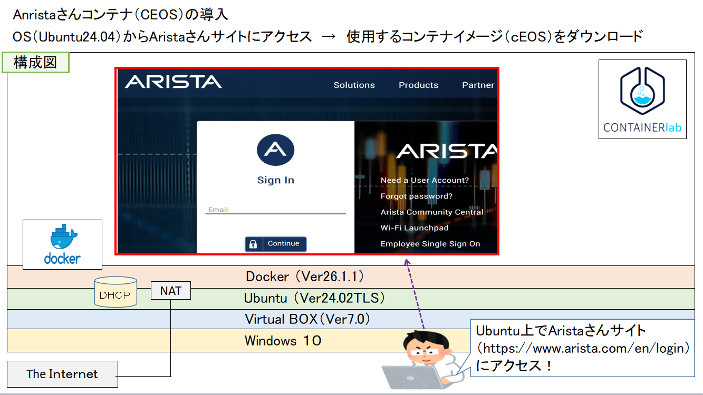
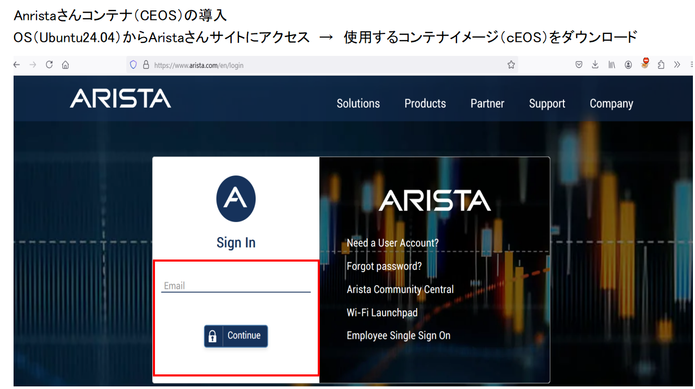
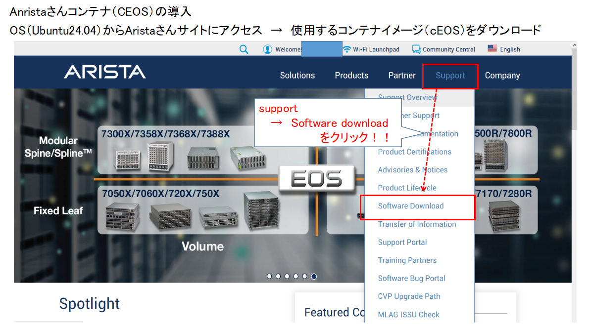
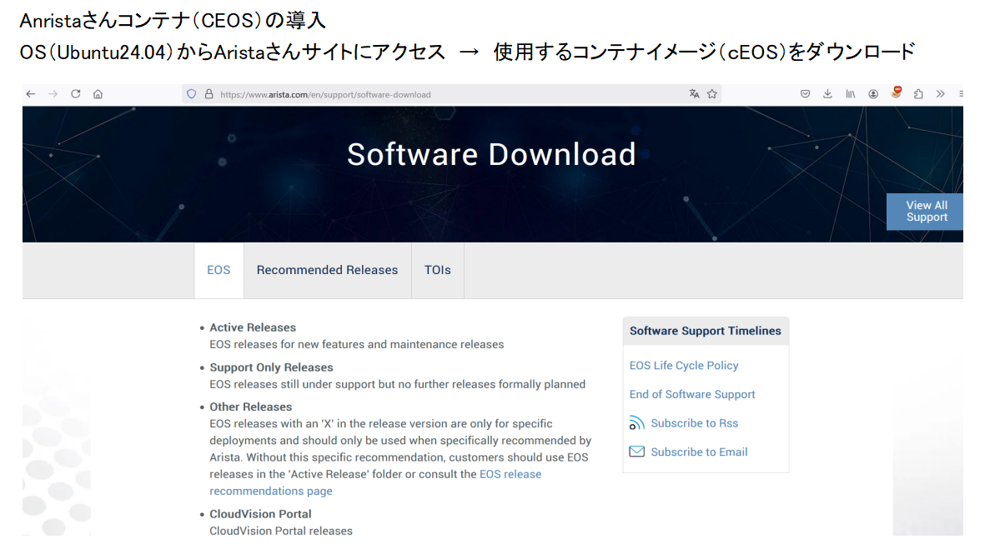
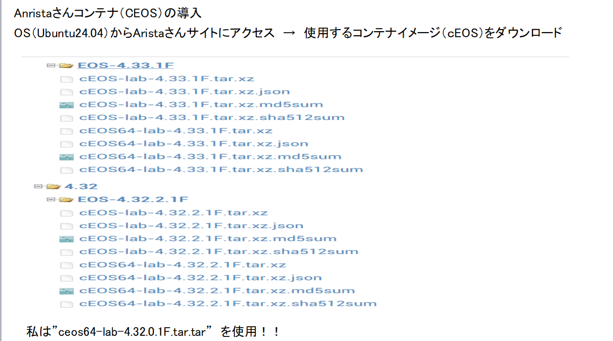
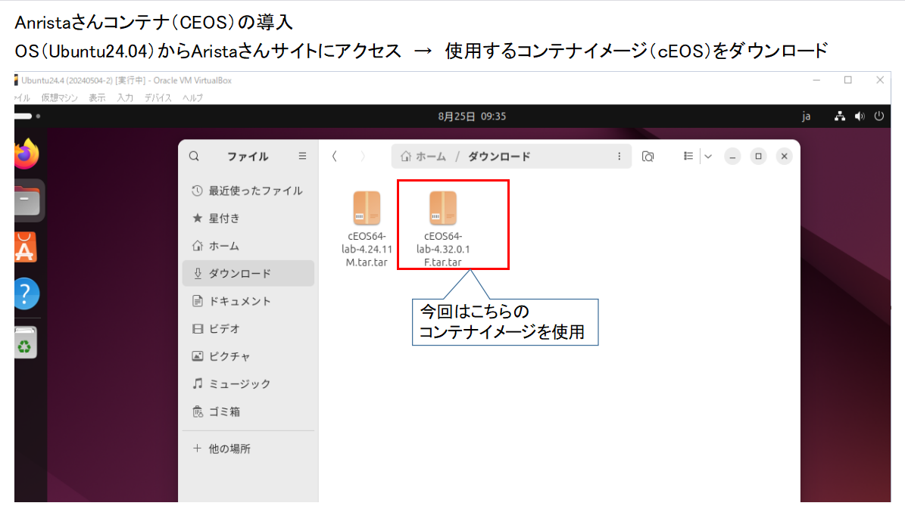
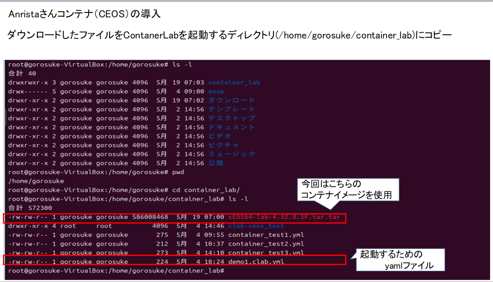
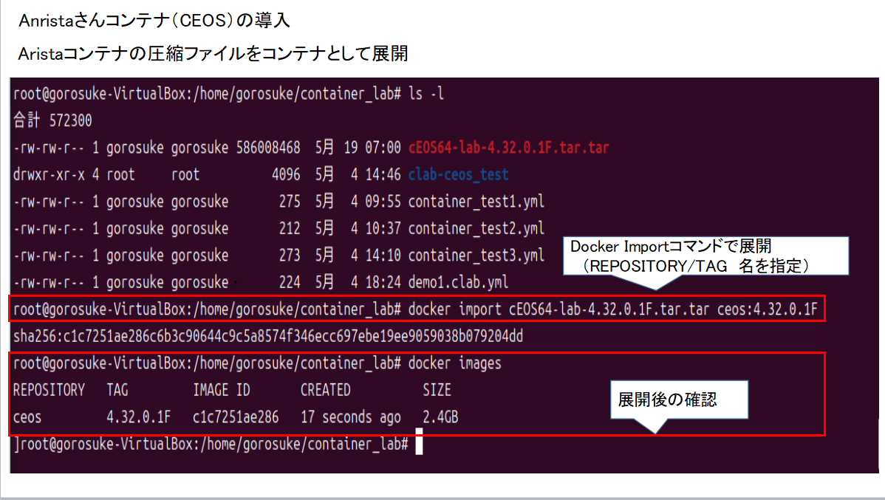

## Aristaネットワークさんコンテナ（CEOS）の導入 

ここではAristaさんコンテナの入手方法からダウンロードおよびデプロイまで説明します 

##### 1　Aristaさんコンテナの入手方法 

　 Aristaさんの公式サイトは以下になります！ 
　 https://www.arista.com/en/ 
　 
AristaさんEOSのコンテナを入手する場合はサイトにユーザ登録する必要があります。 

登録の方法は以下のサイトに紹介されています！ 

シナプス技術者ブログ 
　cEOSをDockerで動かしてみる 
https://tech.synapse.jp/entry/2023/08/01/183000

今回は上記のユーザ登録が終了した前提で進めます

**(1)Aristaさんサイトにアクセスし、登録したユーザでログインします** 
   
   
  　ログイン後、サポート→ソフトウイェアダウンロードをクリックします
  ! 
  
  そうするとダウンロードが可能になります 

  ! 
  ! 
  ! 
  ! 
  ! 

参考ブログ
https://gorosuke5656.hatenablog.com/entry/2024/08/31/085912
