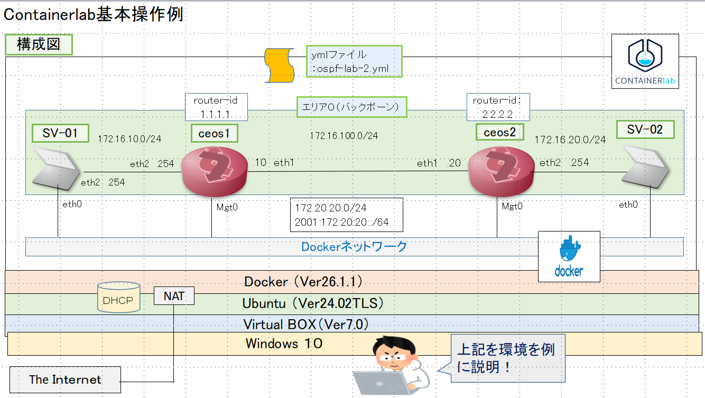
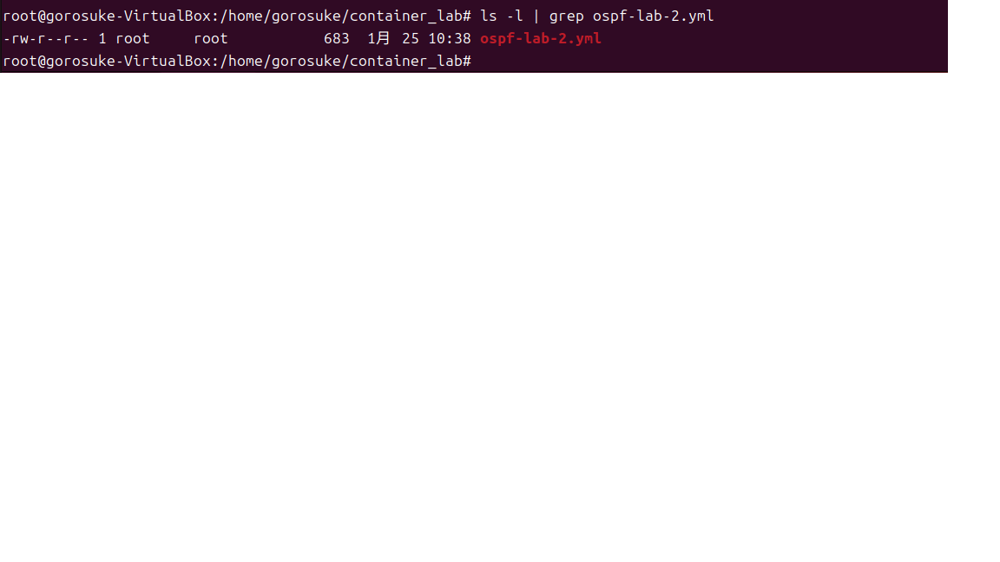
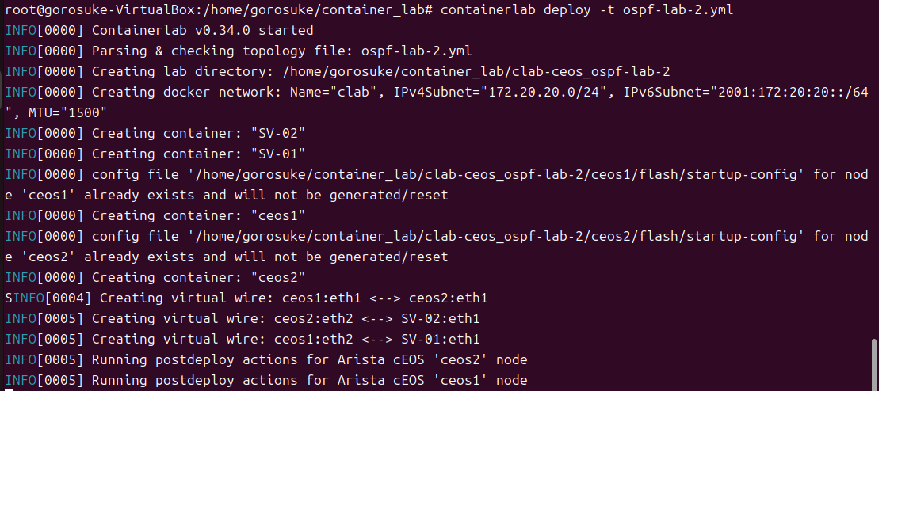
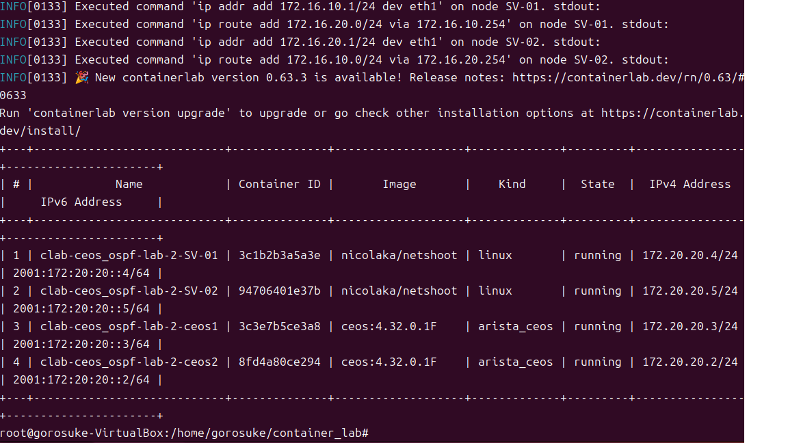
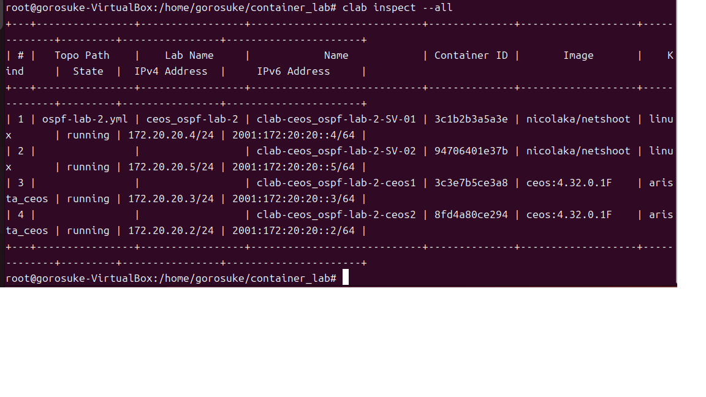
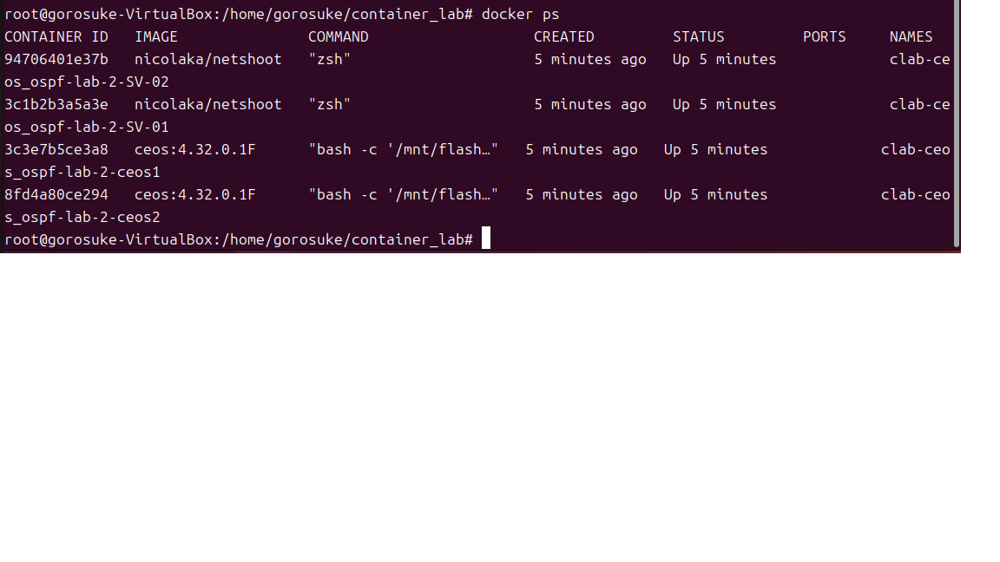
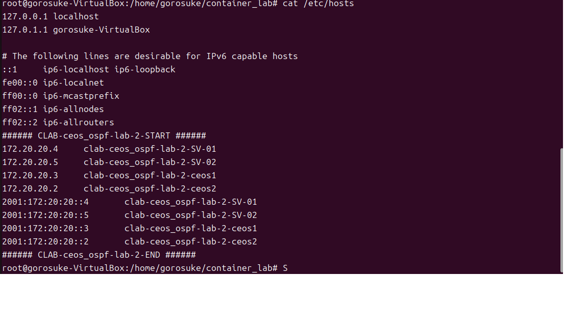
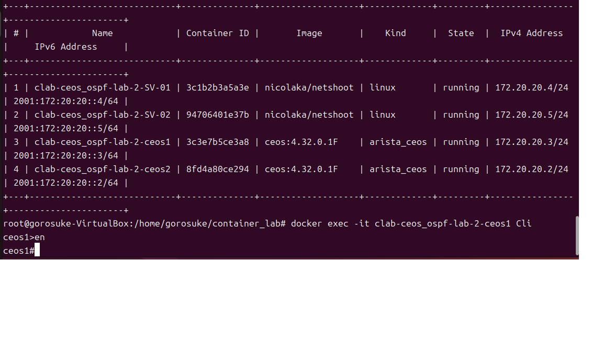
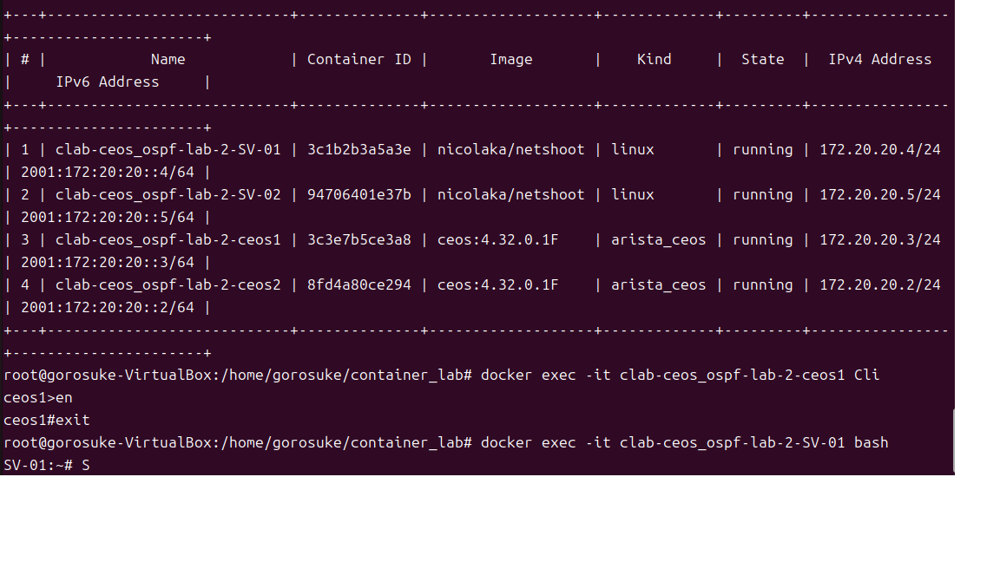
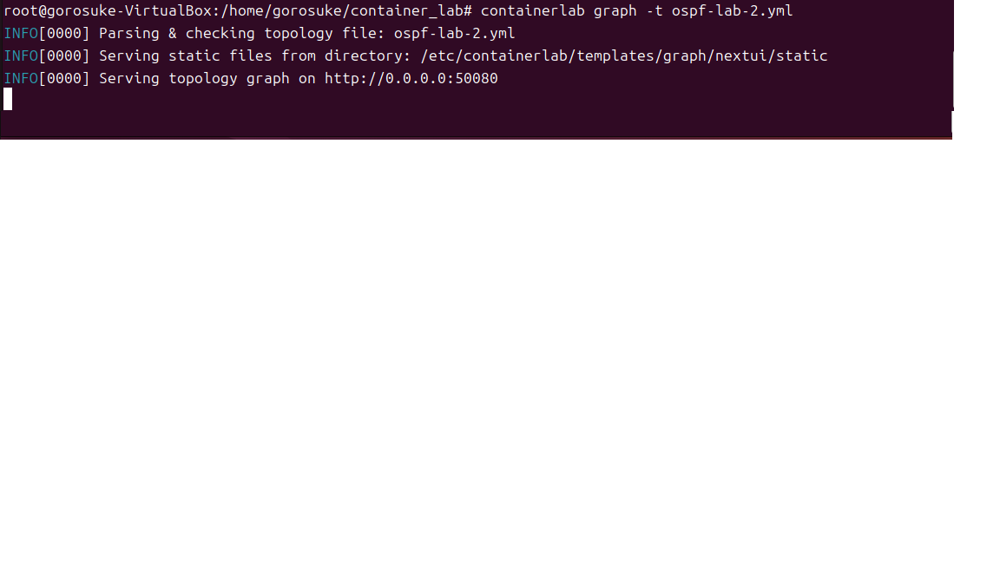

操作の説明として下記の例で説明します 
#### 今回の説明事例 
   
  図のようにCEOS２台とPC(Netshoot）が２台稼働する状態です 
###今回の起動ファイル 
  
起動ファイルは　"ospf-lab-2.yml”になります。 

#####　ContanerLab起動 
管理者権限(root)若しくはsudoコマンドで以下のように指定して起動します 

root@gorosuke-vartual-box:home/gorosuke/container_lab#ContanerLab　deploy -t ospf-lab-2.yml 
 

 ###### 起動後の表示 
 起動が完了すると以下のように表示されます！
 

#### 起動コンテナの状態確認 
root@gorosuke-vartual-box:home/gorosuke/container_lab#clab inspect --all 
 

また以下のようにDocker psコマンドでも確認できます
root@gorosuke-vartual-box:home/gorosuke/container_lab#docker ps 
 
起動したコンテナは/etc/hostsファイルに登録されるためコンテナ名でアクセスが可能です！ 
 

#### 起動コンテナへのアクセス 
起動するコンテナによって若干異なります 
〇 Aristaさんコンテナの場合 
root@gorosuke-vartual-box:home/gorosuke/container_lab#docker exec -it ”ラボ名+コンテナ名" Cli 
 

〇Linux(netshoot)の場合
 root@gorosuke-vartual-box:home/gorosuke/container_lab#docker exec -it ”ラボ名+コンテナ名" bash 
 

#### 起動NWのトポロジー表示 
以下のコマンドでトポロジーファイルを表示できます！ 
 root@gorosuke-vartual-box:home/gorosuke/container_lab#containerlab graph -t  "起動ファイル"  
 

#### 起動コンテナの停止 
 root@gorosuke-vartual-box:home/gorosuke/container_lab#containerlab graph -t  "起動ファイル"  
