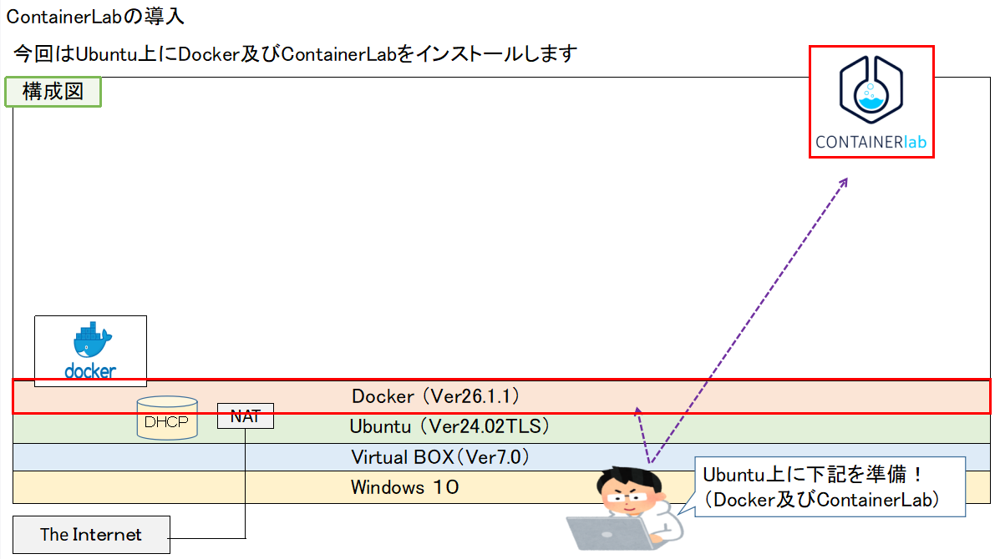
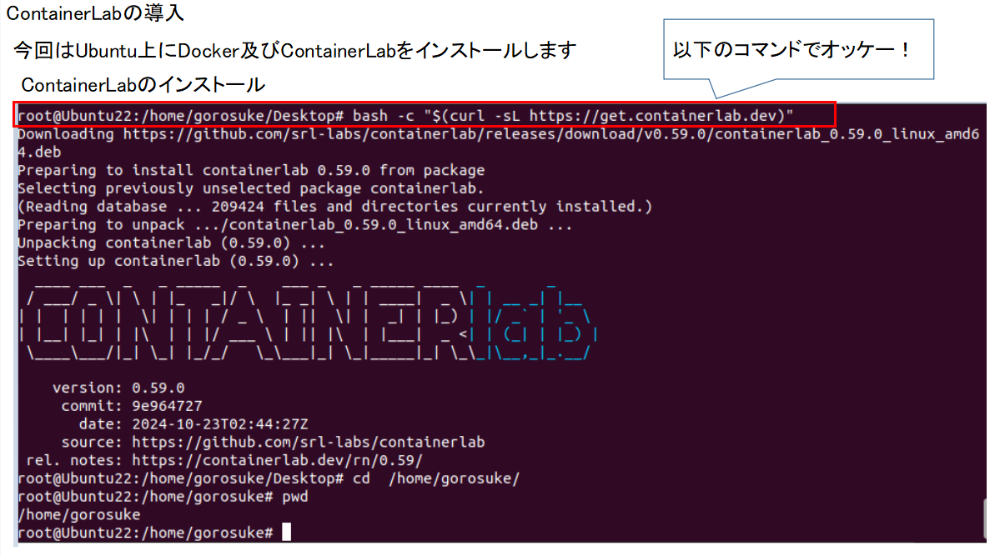
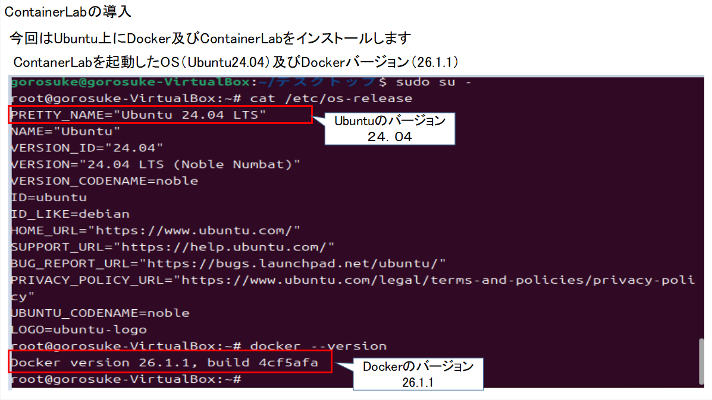

## Container-labの導入 

ここではContainerLabの導入方法について説明します 

公式のインストール要領はこちら！！ 

私は以下の図のようにVirtualBOX上にUbuntu24を準備して 
UbuntuでDockerとContainerLabをインストールしました！ 

 **今回構成した環境** 
   

##### 1　Dockerの導入 
　以下を参考にインストールします 
　 DockerをUbuntuにインストールする公式 
　 https://docs.docker.com/engine/install/ubuntu/ 
　 

#### 2 Container-labの導入 
  以下を参考にインストールします 
  Containerlabのインストール公式,br>
  https://containerlab.dev/install/ 

 

インストール後は以下で確認できます！ 
** インストール後の確認 
 

以下、参考にさせていただいたサイトです！ 
コンテナ環境を使ったネットワーク検証のご紹介 
https://www.sojitz-ti.com/focusarea/column/Arista_cEOS_Containerlab/ 

【Blog Week】containerlabを使ってみた 
https://techblog.ap-com.co.jp/entry/2023/10/26/203441 

クイックスタート Containerlab  Dockerコンテナ的なネットワークラボのご紹介
https://enog.jp/wordpress/wp-content/uploads/2022/11/ENOG76_containerlab_%E4%BA%8B%E5%BE%8C%E8%B3%87%E6%96%99.pdf 

Containerlabを使用した商用環境と同等な検証環境の作成とユースケースについて 
https://www.janog.gr.jp/meeting/janog51/lab/ 
 

  
