### NetShootについて 
Netshootとは？？ 
netshoot は、Docker Hub で公開されている Docker イメージで、 
ネットワークトラブルシューティングやデバッグに役立つ多機能なツールです 
事前に色々なツールがインストールされています！！ 

〇参考にしたサイト 
本家サイト 
　https://github.com/nicolaka/netshoot 
Dockerのサイト 
　https://hub.docker.com/r/nicolaka/netshoot 
Qiitaで参考にしたサイト 
　https://qiita.com/iwaseyusuke/items/c82e810479f9537719c4 

 
### ContainerLabにおけるnetshootのインストール及び確認 

今回、以下の構成でnetshoowを導入してみました！ 
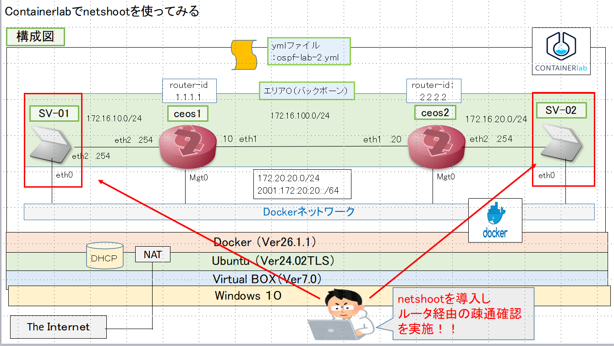 

以下、実施手順です。 

【事前準備】 
###### ①　netshootのインストール 
　　　　Docker Hub から Docker pull コマンドにより　”netshoot”をダウンロードする 
　②　ymlファイルの作成（ファイル：ospf-lab-2.yml) 
　③　ContainerLabの起動　【①のymlファイルを読みこみ起動】 
　④　CEOSにおける設定（OSPF） 

【確認】
　①　netshootにログインし、経路情報を確認 
　②　netshootにログインし、Tracerouteによる確認 
　③　Iperfでの確認 

【設定保存】
　　ContainerLab saveコマンドによる設定保存（CEOSにおいては事前に copy run start を実施しておく） 
 
今回使用したymlファイルは以下に格納しています！！ 
　https://github.com/gorosuke5656/Container-lab/blob/main/yml-file/ospf-lab-2.yml 

#### 事前準備 
###### ①　netshootのインストール 
　　　　Docker Hub から Docker pull コマンドにより　”netshoot”をダウンロードする 
    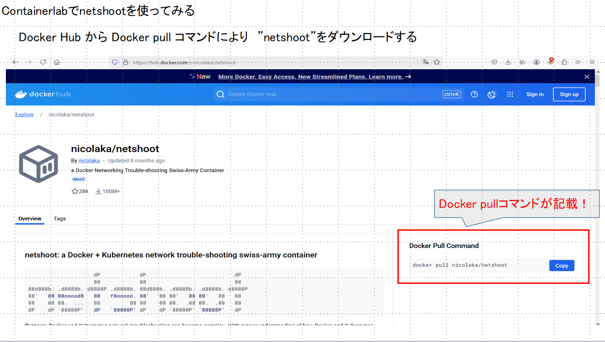 
    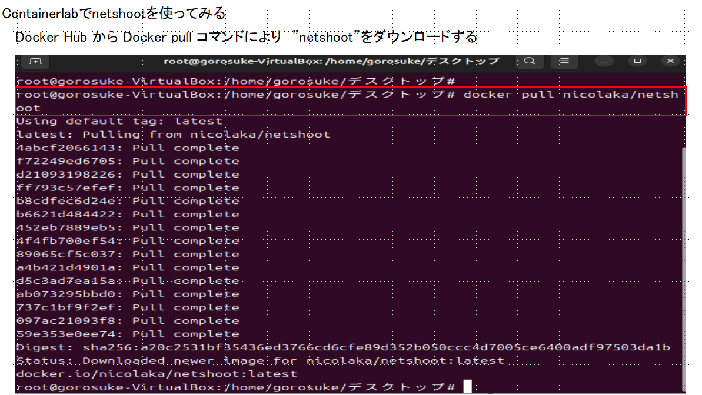 
    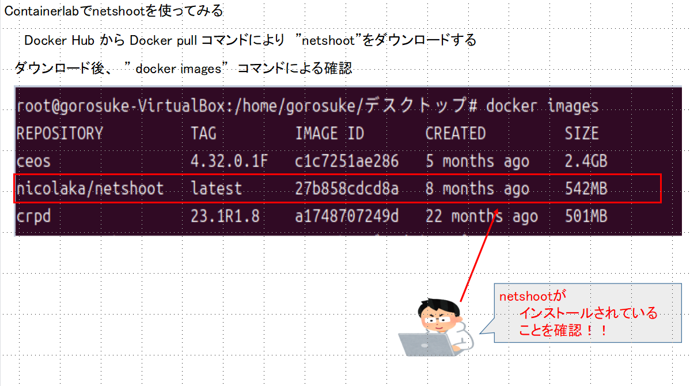 

###### ②　ymlファイルの作成（ファイル：ospf-lab-2.yml) 
   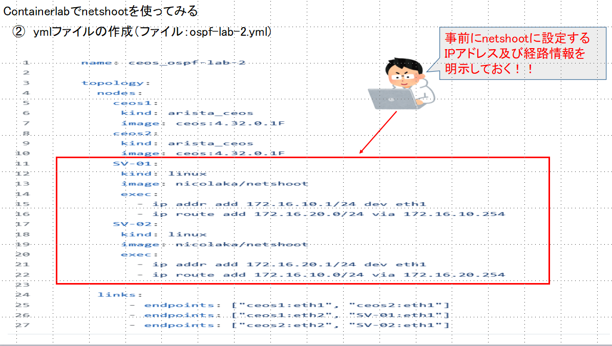 
   ここでポイントですが、事前にnetshootに設定するIPアドレスおよび経路情報を明示して設定しておきます 

###### ③　ContainerLabの起動　【①のymlファイルを読みこみ起動】 
   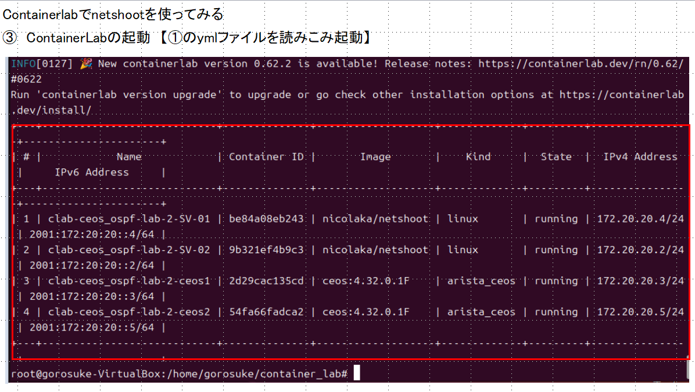 

###### ④　CEOSにおける設定（OSPF） 
    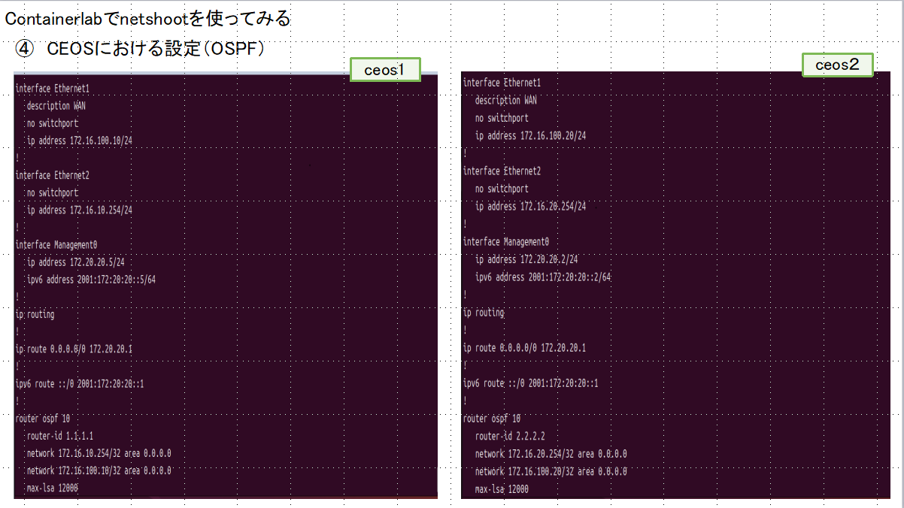 

 #### 【確認】
###### ①　netshootにログインし、経路情報を確認 
　  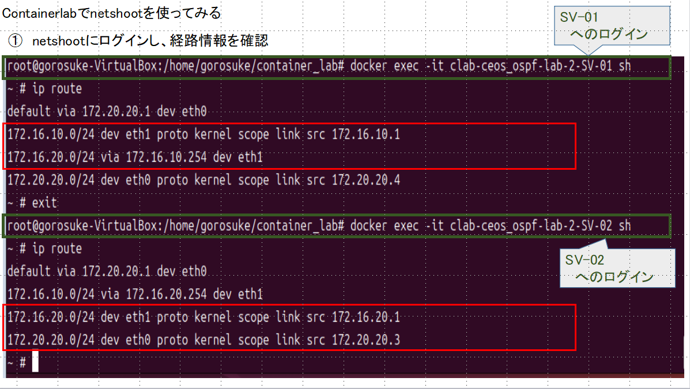 
  
###### ②　netshootにログインし、Tracerouteによる確認 
　  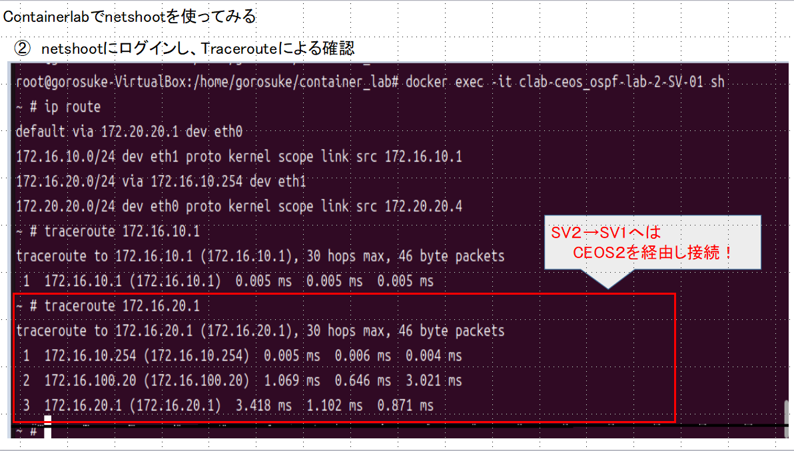 
    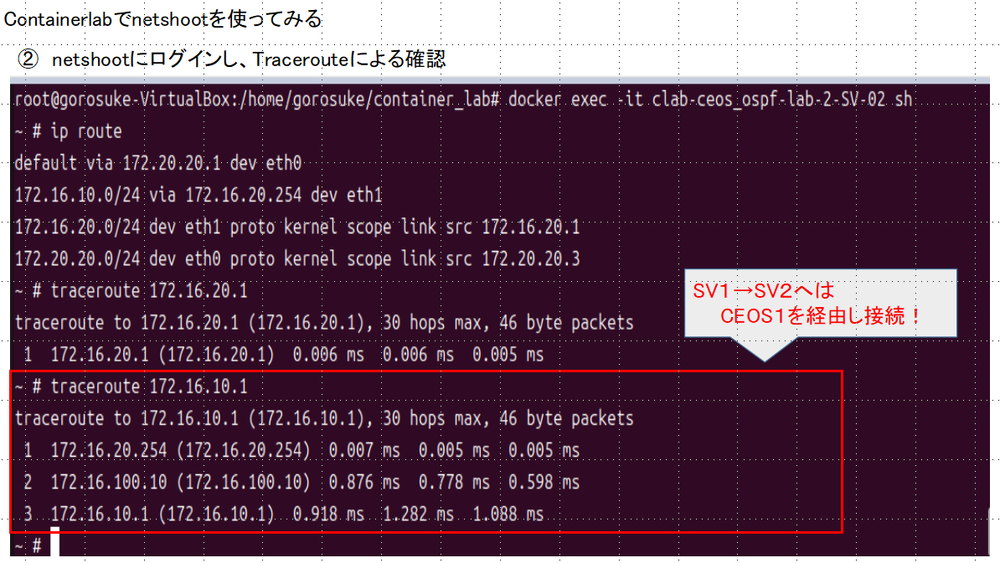 
    
###### ③　Iperfでの確認 
   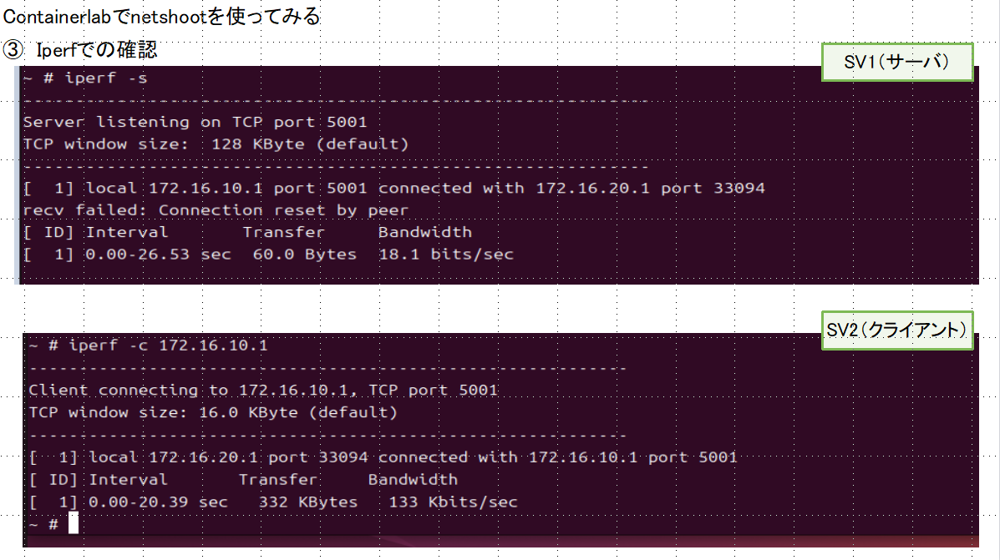 
   
    
   

   

   

    
    

 

 
#
