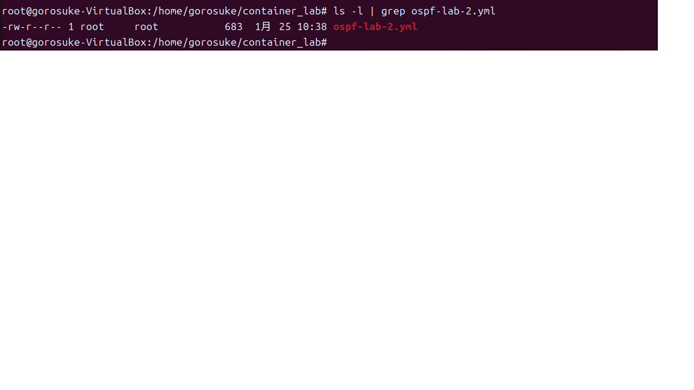
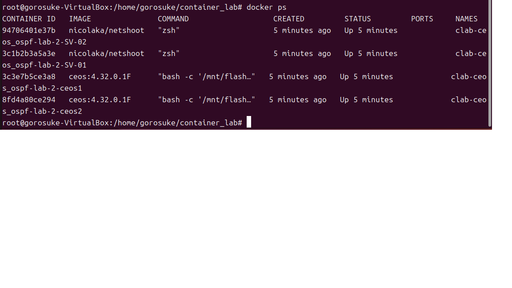
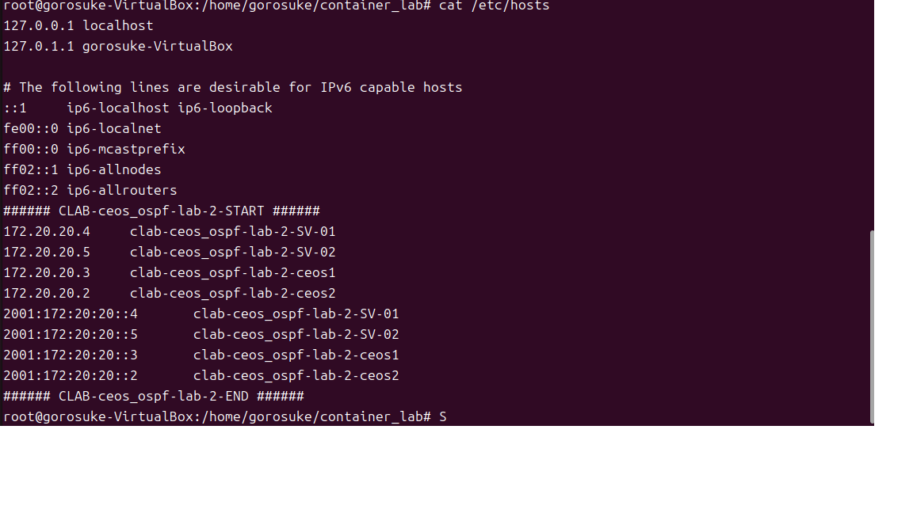

### NetShootについて 
Netshootとは？？ 
netshoot は、Docker Hub で公開されている Docker イメージで、 
ネットワークトラブルシューティングやデバッグに役立つ多機能なツールです 
事前に色々なツールがインストールされています！！ 

〇参考にしたサイト 
本家サイト 
　https://github.com/nicolaka/netshoot 
Dockerのサイト 
　https://hub.docker.com/r/nicolaka/netshoot 
Qiitaで参考にしたサイト 
　https://qiita.com/iwaseyusuke/items/c82e810479f9537719c4 

 
### ContainerLabにおけるnetshootのインストール及び確認 

【事前準備】 
　①　netshootのインストール
　　Docker Hub からnetshootをダウンロードする 

　②　ymlファイルの作成（ファイル：ospf-lab-2.yml) 
　　　以下の条件で設定 

 

今回使用したymlファイルは以下に格納しています！ 
　https://github.com/gorosuke5656/Container-lab/blob/main/yml-file/ospf-lab-2.yml 

 

 
### 今回の起動ファイル 
  
起動ファイルは　"ospf-lab-2.yml”になります。 
##### ContanerLab起動 
管理者権限(root)若しくはsudoコマンドで以下のように指定して起動します 
root@gorosuke-vartual-box:home/gorosuke/container_lab#ContanerLab　deploy -t ospf-lab-2.yml 
 

 ###### 起動後の表示 
 起動が完了すると以下のように表示されます！
 

#### 起動コンテナの状態確認 
root@gorosuke-vartual-box:home/gorosuke/container_lab#clab inspect --all 
 

また以下のようにDocker psコマンドでも確認できます 
root@gorosuke-vartual-box:home/gorosuke/container_lab#docker ps 
 
起動したコンテナは/etc/hostsファイルに登録されるためコンテナ名でアクセスが可能です！ 
 

#### 起動コンテナへのアクセス 
起動するコンテナによって若干異なります 
〇 Aristaさんコンテナの場合 
root@gorosuke-vartual-box:home/gorosuke/container_lab#docker exec -it ”ラボ名+コンテナ名" Cli 
 

〇Linux(netshoot)の場合
 root@gorosuke-vartual-box:home/gorosuke/container_lab#docker exec -it ”ラボ名+コンテナ名" bash 
 

#### 起動NWのトポロジー表示 
以下のコマンドでトポロジーファイルを表示できます！ 
 root@gorosuke-vartual-box:home/gorosuke/container_lab#containerlab graph -t  "起動ファイル"  
 

#### 起動コンテナの停止 
 root@gorosuke-vartual-box:home/gorosuke/container_lab#containerlab graph -t  "起動ファイル"  

